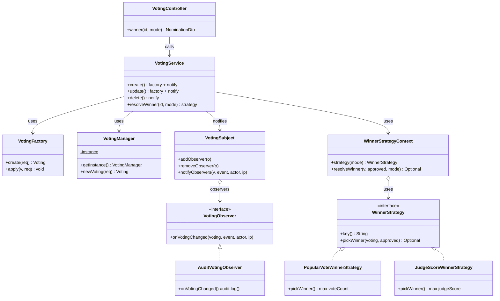
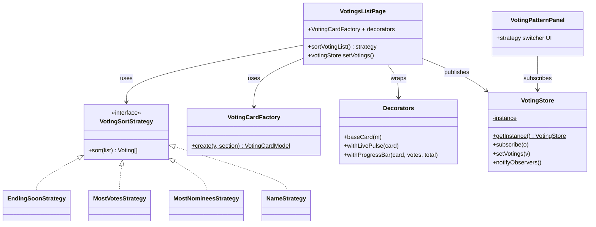

# Voting Management — Design Patterns (AwardHub)

> Scope: only the newly added voting-management patterns (your part).
> Lectures: `lectures/Week11_Lecture_DesignPattern-Part01.pdf` (Singleton, Observer)
> and `lectures/DesignPattern PartII.pdf` (Strategy, Factory, Decorator).
> Diagrams: `voting-design-patterns.drawio` (editable) + `voting-design-patterns.svg` (preview).

## 1. Pattern map

| # | Pattern (lecture) | Backend file | Frontend file | Used in |
|---|---|---|---|---|
| 1 | Factory (Part II) | `backend/src/main/java/com/awardhub/pattern/voting/VotingFactory.java` — `create/apply` | `frontend/src/patterns/votingCardFactory.ts` — `VotingCardFactory.create(v, section)` | `service/VotingService.java:create/update`, `views/VotingsListPage.tsx` card badge |
| 2 | Singleton (Part I) | `pattern/voting/VotingManager.java` — `private ctor + getInstance()` | `patterns/votingObserver.ts` — `VotingStore.getInstance()` | `VotingService.create` via `VotingManager.getInstance().newVoting()`; UI cache `votingStore` |
| 3 | Strategy (Part II) | `pattern/voting/WinnerStrategy.java` + `PopularVoteWinnerStrategy.java` + `JudgeScoreWinnerStrategy.java` + `WinnerStrategyContext.java` | `patterns/votingSortStrategy.ts` — `EndingSoon/MostVotes/MostNominees/Name + sortVotingList()` | `GET /api/votings/{id}/winner?mode=popular\|judge` (`controller/VotingController.java`, `service/VotingService.java:resolveWinner`); list sorting in `VotingsListPage.tsx` |
| 4 | Observer (Part I) | `pattern/voting/VotingObserver.java` + `VotingSubject.java` (`add/remove/notifyObservers`) + `AuditVotingObserver.java` | `patterns/votingObserver.ts` — `subscribe/unsubscribe/notify` | `VotingService` notifies on `VOTING_CREATED/UPDATED/DELETED`; list page publishes via `votingStore.setVotings()` |
| 5 | Decorator (Part II) | — (UI-side only) | `patterns/votingDecorator.ts` — `baseCard → withLivePulse → withProgressBar` | `VotingsListPage.tsx` card rendering |
| UI proof | — | — | `components/VotingPatternPanel.tsx` | Strip on top of `VotingsListPage.tsx`: strategy switcher + Factory/Decorator + Observer count |

## 2. UML (Mermaid — same as .drawio/.svg)

## 3. Runtime flows

**Create voting (Factory + Singleton + Observer):**
`VotingController.create → VotingManager.getInstance().newVoting() → VotingFactory.create() → save → VotingSubject.notifyObservers(VOTING_CREATED) → AuditVotingObserver.onVotingChanged → audit.log`

**Winner (Strategy):**
`GET /api/votings/{id}/winner?mode=judge → VotingService.resolveWinner → WinnerStrategyContext.strategy("judge") → JudgeScoreWinnerStrategy.pickWinner → NominationDto`

**List UI (Strategy + Factory + Decorator + Observer/Singleton):**
`api.votings() → votingStore.setVotings() (notify) → sortVotingList(list, sortKey) → VotingCardFactory.create() → withLivePulse → withProgressBar → card`

## 4. Files

Backend (`backend/src/main/java/com/awardhub/pattern/voting/`):
`VotingFactory.java`, `VotingManager.java`, `WinnerStrategy.java`,
`PopularVoteWinnerStrategy.java`, `JudgeScoreWinnerStrategy.java`,
`WinnerStrategyContext.java`, `VotingObserver.java`, `VotingSubject.java`,
`AuditVotingObserver.java` + edits in `service/VotingService.java`, `controller/VotingController.java`.

Frontend (`frontend/src/`):
`patterns/votingSortStrategy.ts`, `patterns/votingCardFactory.ts`,
`patterns/votingObserver.ts`, `patterns/votingDecorator.ts`,
`components/VotingPatternPanel.tsx` + edits in `views/VotingsListPage.tsx`.
